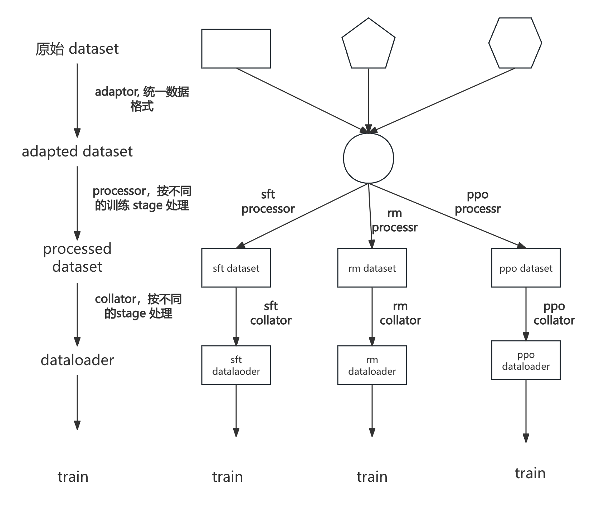

# gcore dataset 

## 背景
注意到目前接入一个新模型的时候，很大一部分工作是在编写dataloader 的数据预处理部分代码，多模态模型尤甚。这个工作是case by case 的，每接入一个模型都要做一遍。这就存在两个问题。
一是代码重复， 数据预处理的逻辑很多是类似的，代码存在一定的冗余；二是代码膨胀，难以阅读，各个模型由不同的同学接入，dataloader 部分的代码缺乏统一的设计与规范。

## 整体设计



* 接入新的dataset 只需加一层 adaptor

* 接入新的模型复用 llama factory 的 template 即可, 理论上没有额外工作（当然需要验证一下正确性）
  * 预处理 dirty work delegate to llama-factory
  * 顶多自定义一下 collator

* 支持新的训练 stage/场景只需实现对应的 processor 与 collator
  * processor 可以做到分不同的训练 stage / 场景通用
  * default collator 可以处理大部分情况（大部分模型）
    * 对于多模态模型，如果 default collator 无法满足需求，那就继承一下（依然可以复用代码），写点自定义的 collator 逻辑


## 使用文档


### dataset 实现

目前的实现支持三种 dataset 实现， 分别是 llama factory、 energon、 gore_datasetV4。这三种载入方式分别满足不同的需求。

在正式介绍之前，先澄清三个有联系又有区别的概念， 文件格式、数据格式、dataset 实现。

文件格式： 结构化数据如何存储在文件中

数据格式： 数据的结构，在我们的上下文中特指 json schema, 目前我们支持四种格式， 分别是开源的格式 alpaca 、sharegpt、openai  以及我们内部的 gcore_native。 gcore_native 可以和sharegpt 互转。

dataset 实现： dataset 实现, 指如何把样本从文件中load 出来， 并做些 map, filter, batch 等处理。


| dataset 实现      | 支持的文件格式                       | 支持的数据格式          | 适用场景              |
|-----------------|-------------------------------|------------------|-------------------|
| llama factory   | 本地jsonl 以及 HuggingFace / ModelScope / Modelers hub datasets | alpaca、sharegpt、openai | gcore 初体验         |
| energon         | jsonl                         | gcore_native、alpaca、sharegpt、openai | 支持接续训练， 数据 replay |
| gore_datasetV4    | jsonl                         | gcore_native、alpaca、sharegpt、openai | 支持扩缩卡接续训练         |


使用建议


* llama factory data 可以快速接入开源数据集
* 如果是 jsonl 存储的 llama factory data, 可以快速地迁移到用 energon 加载。
* 如果没有比较强的扩缩卡接续训练的要求，我们建议使用 energon dataset.
* 如果需要 扩缩卡接续训练， 使用 gore_datasetV4。


### 使用 demo

我们以 examples/hessianliu/data/sharegpt_sft_demo.jsonl 为例子，分别阐述三种数据集实现如何载入数据，进行 sft 训练。训练 demo 脚本在 tasks/glm4v/sh/mpirun_glm4p5vl_sft_energon.sh

#### 一、 配置

我们尽量采用与 llama factory 一致的配置方式， 降低用户的使用成本。
具体而言， 用户指定 data_dir， 该目录下有个 dataset_info.json 文件存储多个数据集的元信息。
通过 dataset 与 eval_dataset 配置分别指定用dataset_info.json 里的某个数据集作为 train dataset 和 eval dataset.

关于llama factory 加载数据的方式，具体可以参考 [llama factory data preparation](https://github.com/hiyouga/LLaMA-Factory?tab=readme-ov-file#data-preparation).


#### 二、llama factory dataset 


dataset_info.json 内容

```
{   
    "demo": {
        "file_name": "sharegpt_sft_demo.jsonl",
        "formatting": "sharegpt",
        "columns" : {
            "messages" : "conversations",
            "images" : "images"
            }
            ,
        "tags": {
            "role_tag": "role",
            "content_tag": "content",
            "user_tag": "user",
            "assistant_tag": "assistant",
            "system_tag": "system"
            }
    }
}

```

配置
```
--template glm4v \
--dataset-dir examples/hessianliu/data \
--dataset-impl llamafactory \
--dataset demo \

```

dataset_info.json 需要在 dataset_dir 目录下，如果 dataset_info.json 里的file_name 是相对路径，以 dataset_dir 为起始目录。

#### 三、energon dataset

energon 需要预处理， 其他与 llama factory data 的配置使用方式一样。

##### 1、预处理

energon prepare

```
bash gdataset/data/tools/prepare_energon.sh ./examples/hessianliu/data/sharegpt_sft_demo.jsonl
```


##### 2、使用数据集
dataset_info.json 内容同上。

配置
```
--template glm4v \
--dataset-dir examples/hessianliu/data \
--dataset-impl energon \
--dataset demo \
--dataloader-save ./dataloader_save \
```

dataset_info.json 需要在 dataset_dir 目录下，如果 dataset_info.json 里的 file_name 是相对路径，以 dataset_dir 为起始目录。如果是单个文件， dataset_info.json 里的 file_name 就是数据文件名。如果是多个文件， file_name 指向的是 energon yaml meta 文件。


#### 四、gore_datasetV4 dataset

##### 1、预处理

##### 2、使用数据集

dataset_info.json 内容

```
```

配置
```

```

#### 五、高级特性
图片加载可能成为瓶颈， 我们支持按 key 从其他存储介质读取. 这个功能是与 dataset 实现解耦合的， 三种 dataset 实现都支持。


