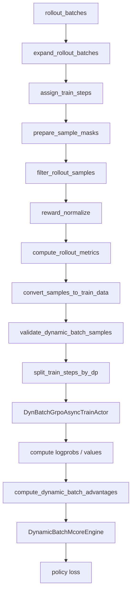

# Dynamic Batch Data Pipeline 设计

本文面向维护 G-Core V4 RL pipeline 的开发者，说明 `dynamic_batch_train` 相对原 `rollout + GrpoAsyncTrainActor.generate_ppo_data()` 路径的职责重构、关键数据语义和实现取舍。

## 背景

legacy single-controller 路径的数据流大致为：

```text
RolloutController
  rollout / reward
  -> 按 DP rank 拆分 rollout_batches

GrpoAsyncTrainActor（每个 DP rank）
  -> filter sampling
  -> compute ref/prev logprobs
  -> compute rollout metrics
  -> compute values
  -> generate_ppo_data
       mask 对齐
       sample_mask 应用
       reward/advantage
       GDPO post-advantage
       whiten / clip
       PPO metrics
  -> 展开 rollout_batches
  -> 按固定 train_gbs 切 train steps
  -> MCore train
```

`generate_ppo_data()` 同时承担了数据清洗、group 统计、依赖模型输出的算法计算和指标汇总。它建立在以下前提上：

- rollout batch 的行数等于固定的 `rollout_mbs * sampling_keep_n`；
- DP rank 在相同位置处理相同数量的 rollout batch；
- 训练样本数可以由 `rollout_gbs * sampling_keep_n * rb_multiplier` 静态推导；
- train step 可以在 Actor 侧通过固定长度切分得到；
- 一条 trajectory 通常对应一行 sample。

当 rollout 产生动态数量的 samples，或一条 trajectory 被拆成多个 segment 时，上述前提不再成立。

## 设计目标

dynamic batch pipeline 的目标是：

1. 在 DP 拆分前完成依赖全量 rollout/group 视图的处理；
2. 允许 filter 和业务转换改变每个 train step 的 sample 行数；
3. 保证 prompt、group 和 trajectory 的统计边界不被 DP 分片破坏；
4. 将纯 sample/reward 计算与依赖 logprobs/value 的计算分离；
5. 让 MCore 使用每个 step 的实际 GBS、有效 GBS 和 token 数归一化；
6. 为 multi-segment 等业务提供稳定的 sample-level hook；
7. 与 Dynamic CP 的长度调度组合，降低 DP 尾部和长短序列 padding 浪费。

非目标：

- 不修改 legacy `generate_ppo_data()` 及其 advantage/post-advantage 注册表语义；
- 不让 dynamic path 兼容所有 legacy advantage/loss；
- 不在过滤后自动补 sample、重排 prompt 到其他 step 或静默跳过空 step；
- 不把 reward normalize 强行合并进最终 token advantage。

## 新数据流



入口位于 `RolloutController._prepare_variable_sample_count_train_data()`。执行顺序是公共协议的一部分：

1. 展开 rollout batch；
2. 根据 prompt 规划 `_train_step_id`；
3. 创建或对齐 response mask，并应用 `sample_mask`；
4. 执行内置 filter，再执行 custom filter；
5. 执行内置或 custom reward normalize；
6. 计算内置或 custom rollout metrics；
7. 执行 custom train-data convert；
8. 校验字段、层级边界和有效样本；
9. 逐 train step 按序列长度分配到 DP rank。

Actor 收到的数据已经是 `list[train_step]`，不再调用 legacy `generate_ppo_data()`，也不再根据固定 GBS 二次切 step。

## 职责拆分

### RolloutController：全局 sample 语义

Controller 负责只依赖 rollout 数据、且要求完整统计域的工作：

- train-step 规划；
- mask 和 sample validity；
- sample/trajectory/group filter；
- trajectory reward 聚合与 group reward normalize；
- pre-DP rollout/advantage metrics；
- 业务 train-data conversion；
- DP 长度负载均衡。

这样做的原因是 Controller 在 DP 拆分前拥有完整 group。若先拆 DP：

- 同一 group 可能落到多个 rank；
- multi-segment trajectory 可能被 rollout-batch 边界切开；
- filter 后各 rank 行数不同；
- 为恢复全局统计必须引入额外 gather/all-reduce 和顺序约束。

### Actor：模型相关语义

`DynBatchGrpoAsyncTrainActor` 负责：

- 将当前 DP shard 广播到 TP/PP/CP rank；
- 计算 reference/previous-policy logprobs；
- PPO 场景计算 values；
- 逐 `_train_step_id` 计算最终 token advantage/returns；
- 跨 DP whiten、clip 和最终 PPO metrics；
- 驱动 policy/value engine。

logprobs/value 必须在 Actor 计算，因为它们依赖 GPU 模型和并行拓扑。把 reward normalize 留在 Controller、把最终 advantage 留在 Actor，形成明确的两阶段协议。

### DynamicBatchMcoreEngine：实际训练规模

Engine 逐 train step 处理动态长度的 sample list：

1. 在 Dynamic CP reroute 前统计实际 GBS、有效 GBS 和 response token 数；
2. 根据是否启用 Dynamic CP 选择动态 reroute 或静态 microbatch；
3. 执行 forward/backward；
4. 使用该 step 的实际统计量缩放 loss；
5. 每个 train step 独立 optimizer step。

`training.train_gbs` 在 dynamic pipeline 中是 train-step 规划使用的 nominal sample/trajectory 数，不再要求等于 custom conversion 后的实际 sample 行数。

## 关键设计决策

### 1. 先固定 train-step 边界，再过滤

`assign_train_steps()` 按 `prompt_idx` 分组。每个 train step 的 nominal prompt 数为：

```text
prompts_per_step = train_gbs / (sampling_keep_n * rb_multiplier)
```

完整 prompt 及其 group 不会跨 step。之后 filter 可以改变 step 内行数，但 `_train_step_id` 不重新计算。

该选择有三个作用：

- whiten、metrics 和 optimizer step 具有稳定的统计边界；
- 不会因为过滤结果变化而把相邻 prompt 搬入当前 step；
- 各 DP rank 的 collective 调用次数保持一致。

代价是 filter/convert 不允许删除整个 train step。框架在这种情况下直接 assert，而不是补占位数据或静默跳步。

### 2. mask 在 Controller 统一规范化

`prepare_sample_masks()` 将 `mask` 统一为 next-token 轴，长度必须为 `len(tokens) - 1`：

- 缺失 mask：由 `prompt_lengths/sequence_lengths` 创建 response mask；
- 已有 mask：只允许右侧补零，不允许超过目标长度；
- 缺失 `sample_mask`：补 `True`；
- `sample_mask=False`：将 token mask 清零。

reward normalize、metrics、convert、Actor advantage 和 loss 因而共享同一 validity 语义。custom hook 不应重新定义 mask shape。

### 3. 将 group reward normalize 与最终 advantage 拆成两阶段

group-relative 算法只需要 reward 和层级 ID，不需要 logprobs/value。因此在 Controller 中先写入 sample-level 标量 `normalized_rewards`。

Actor 获得 logprobs/value 后：

- GRPO/GDPO：把 `normalized_rewards` 按 mask 展开成 token advantage；
- identity：从原始 reward 生成 token advantage；
- reinforce：计算 discounted advantage；
- PPO：结合 value、per-token reward 和 initial-policy KL 计算 GAE；
- custom：调用用户注册的 dynamic advantage。

这避免了曾经为复用 `generate_ppo_data()` 而临时把 `advantage_type` 切成 `identity` 的隐式状态，也避免重复执行 group normalize。

### 4. 原始 reward 与 normalized reward 分字段保存

`rewards` 始终保留 rollout 原始结果；group 算法写入新的 `normalized_rewards`。

这一约定支持：

- rollout reward metrics 继续报告可解释的原始分数；
- custom metrics 同时观察 raw/normalized reward；
- multi-segment 在聚合 reward 后仍能保留各 segment 的原始贡献；
- debug dump 能区分环境输出与算法派生值。

### 5. trajectory 是 group normalize 的基本单位

内置 group 算法以 `(group_id, traj_id)` 标识 trajectory：

```text
trajectory_reward = sum(segment.rewards)
normalized_reward = normalize(
    all valid trajectory_reward values in group_id
)
```

结果写回 trajectory 的每个 segment。`sample_mask` 必须在 trajectory 内一致。

如果 group 内只剩 0 或 1 条有效 trajectory，标准差不再有意义。内置 reward normalize 保留数据结构，但将整组 `sample_mask`、`mask` 和 `normalized_rewards` 置零。若用户希望物理删除，应显式配置 `sample-mask` 和 `valid_group` filter。

### 6. GDPO 的统计域在 Controller 明确定义

当前实现的统计域：

- `gdpo`：本次 Controller 收集到的全部 rollout samples 上做 token-BN；
- `gdpo_sample_bn`：全部 rollout trajectories 上做 sample-BN；
- `group_gdpo`：逐 `group_id` 做 token-BN；
- `group_gdpo_sample_bn`：逐 `group_id` 做 sample-BN。

这里的“全局”发生在 DP 拆分前，因此不依赖各 DP rank 恰好处理相同数量、相同顺序的 rollout batches。

### 7. whiten、clip 与 returns 分离

Actor 按 train step 执行通用后处理：

1. advantage 算法返回 `advantages`、`returns` 和可选 initial-policy KL；
2. 可选跨 DP whiten；
3. 可选 advantage clip，并保留 `original_advantages`；
4. 统计最终 advantage/return/value 等指标。

`returns` 不跟随 whiten/clip，因为 PPO 的 returns 是 value target，而不是 policy loss 的数值稳定化中间量。

当前实现只允许 `identity`、`reinforce`、`ppo` 和 `grpo` 开启 `whiten_advantages`。GDPO 已经有自己的 BN，不进入通用 whiten。

### 8. DP 调度按 token 长度而不是行号

`split_train_steps_by_dp()` 对每个 train step：

1. 按 `sequence_lengths` 降序；
2. 每次把最长的剩余 sample 放到当前 token 总量最小的 DP rank；
3. 保证每个 DP rank 非空。

未启用 Dynamic CP 时，调度还要满足固定容量：

```text
num_samples % (dp_size * train_mbs) == 0
```

启用 Dynamic CP 后允许各 DP rank 获得不同 sample 数；后续 DP×CP reroute 根据序列长度重新选择 CP 资源并打包。

### 9. loss 使用实际 GBS 和有效 GBS

`DynamicBatchMcoreMixin._compute_step_gbs_and_token_cnt()` 在每个 optimizer step all-reduce：

- `gbs`：custom conversion 后的实际 sample 行数；
- `effective_gbs`：`sample_mask=True` 的 sample 数；
- `token_cnt`：有效 response token 数。

seq-mean 路径按 `effective_gbs` 缩放；token-mean 路径按有效 token 数缩放。这样 filtering 和 multi-segment 不再受 nominal `train_gbs` 断言限制。

### 10. `token_weights` 只改变 loss 分子

新 loss 的 `agg()` 支持 `[B, 1]` 或 `[B, S]` 的 `token_weights`。权重只乘 loss 分子，分母仍是有效 sample 数或 token 数。

输入协议按全局 train step 限制 shape mode：所有 samples 必须同时存在或同时缺失 `token_weights`；存在时只能全部使用 scalar `[1]`，或全部使用 token-level `[S]`。静态和 Dynamic CP collate 会再次校验，禁止两种模式在同一 batch 混用。

multi-segment ReTool 利用这一点保持 trajectory 等权。设一个 step 有 `M` 个有效 segment、`N` 条 trajectory，trajectory `i` 有 `S_i` 个 segment：

```text
w_i = M / (N * S_i)
```

seq-mean 下：

```text
loss
= (1 / M) * sum_i sum_{segment in i} w_i * segment_loss
= (1 / N) * sum_i mean_segment_loss_i
```

因此 segment 数量不会改变 trajectory 的总训练权重。

## Hook 协议与顺序

| 阶段 | 配置 | 接口 | 替换/追加语义 |
|------|------|------|---------------|
| filter | `training.ppo_filter_samplings_path/name` | `(config, samples) -> samples` | 在内置 filter 列表后追加 |
| reward normalize | `ppo.custom_reward_normalize_py_path/name` | `(config, samples) -> metrics` | 完整替换内置 normalize |
| rollout metrics | `training.custom_compute_rollout_metrics_path/name` | `(config, samples) -> metrics` | 完整替换内置 metrics |
| train-data convert | `training.custom_convert_samples_to_train_data_path/name` | `(config, samples) -> samples` | 在 metrics 后追加转换 |
| final advantage | `ppo.custom_advantage_py_path/name` | `(config, samples) -> (advantages, returns, init_policy_kl)` | Actor 中覆盖同名 dynamic advantage |

hook 共享以下约束：

- 不使用 try/except 隐藏字段或 shape 错误；
- 原地修改 sample 时应保持 `_train_step_id`；
- prompt/group 不能跨 train step；
- filter/convert 后每个 train step 至少有一个有效 sample；
- group-relative reward normalize 必须写标量 `normalized_rewards`；
- custom advantage 返回 list 长度必须与当前 step 的 samples 一致。

metrics hook 在 convert 前执行，因此它不应依赖仅由 convert 新增的字段。需要同时报告转换相关指标时，应从原始 sample 重新计算期望值，或让更早阶段已经提供对应字段。

## Metrics 分层

Controller 指标：

- rollout 长度、原始 rewards 和业务 metrics；
- GDPO pre-DP BN metrics；
- custom reward normalize/rollout metrics。

Actor 指标：

- final `advantages`、`original_advantages`、`returns`、`values`、`per_token_rewards`；
- sample retention；
- advantage clip 比例；
- initial-policy KL；
- policy/value engine loss、grad norm 和性能数据。

Controller 产生的 metrics 作为 extra metrics 合并到最终上报结果。这样 rollout 指标不再被 DP 分片重复计权，模型相关指标仍通过 DP collective 得到全局值。

## 与 legacy 路径的对比

| 维度 | Legacy `GrpoAsyncTrainActor` | Dynamic batch |
|------|------------------------------|---------------|
| Controller 输出 | DP shard 的 rollout batches | DP shard 的 `list[train_step]` |
| 过滤位置 | Actor 内，DP 拆分后 | Controller 内，DP 拆分前 |
| mask 整理 | `generate_ppo_data()` | Controller |
| group reward normalize | Actor advantage/post-advantage | Controller |
| 最终 advantage | `generate_ppo_data()` | Dynamic Actor，逐 train step |
| train-step 划分 | Actor 按固定行数切分 | Controller 在 filter 前标记 |
| sample 数 | 固定公式推导 | 每 step 可变 |
| DP 分配 | rollout-batch/行级固定拆分 | 每 step 按 token 长度贪心平衡 |
| multi-segment | 需要 Actor 特化逻辑 | Controller hook + `token_weights` |
| loss 归一化 | 依赖配置中的固定规模 | 使用实际/effective GBS 或 token 数 |
| 扩展接口 | rollout-batch、legacy advantage context | sample-level staged hooks |

两条路径并存。`dynamic_batch_train=False` 时仍使用 legacy `generate_ppo_data()`，避免此次重构改变已有训练任务的数值语义。

## Dynamic CP 集成边界

dynamic batch 与 Dynamic CP 是正交但互补的两层：

- dynamic batch 决定 samples 的语义处理、train-step 边界和 DP 初始分配；
- Dynamic CP 决定每条序列在 DP×CP 资源池中的 reroute、CP 大小和 THD packing。

训练 loss 前，Dynamic CP 的模型输出会重建并 response-pad 到 `[B, R_max]`，rollout 字段也转换到同一形状，再进入新的 policy loss。loss 层不直接处理 THD offsets。

因此：

- dynamic batch 可以在不开 Dynamic CP 时运行，但必须满足静态整除约束；
- Dynamic CP 不会替代 group/trajectory 数据语义；
- `token_weights`、`sample_mask`、mask 和 advantages 必须与 response-padded loss operands 对齐；
- PPO critic 的 dynamic-batch 训练当前不支持 Dynamic CP。

## 代码地图

| 文件 | 职责 |
|------|------|
| `gpatch_v4/rollout_generator/async_rollout/rollout_controller.py` | dynamic pipeline 编排和 hook 加载 |
| `gpatch_v4/utils/dynamic_batch_utils.py` | step 规划、metrics、convert、DP 调度和层级校验 |
| `gpatch_v4/utils/filter_samplings.py` | dynamic sample filter registry |
| `gpatch_v4/core/dynamic_batch_reward_normalize.py` | mask 规范化、GRPO/GDPO pre-DP normalize |
| `gpatch_v4/core/dynamic_batch_advantage.py` | Actor final advantage、whiten、clip 和 metrics |
| `gpatch_v4/actor/grpo_async_dynamic_batch_actor.py` | dynamic actor 数据消费和训练循环 |
| `gpatch_v4/training_backend/megatron_backend/dynamic_batch_mcore_engine.py` | 动态 step 的 MCore forward/backward |
| `gpatch_v4/training_backend/megatron_backend/mixin.py` | 实际 GBS/effective GBS、loss scaling、Dynamic CP loss 对齐 |
| `gpatch_v4/training_backend/loss/utils.py` | seq/token mean 和 `token_weights` 聚合 |
| `tasks/retool/multi_segment/dynamic_batch_hooks.py` | multi-segment trajectory 等权示例 |

## 设计代价

- Controller 增加了 filter、reward normalize、metrics、convert 和 DP 调度等串行 CPU 工作；
- legacy 与 dynamic path 使用两套 advantage 协议，需要分别维护数值语义；
- DP 引用的数据结构从 rollout-batch list 变为 `list[train_step][sample]`，debug dump 不能混用；
- Dynamic MCore Engine 需要逐 step 统计分母并执行 optimizer step，不能再从 nominal GBS 静态推导；
- dynamic Actor 暂未接回 `display_rollout_generation`，调试展示能力弱于 legacy 路径；
- 更严格的 assert 会让不完整 group、空 step 和错误 shape 提前失败，但可避免分布式训练静默使用错误统计域。

## 当前限制

- 仅支持 single-controller + MCore；
- 只支持 pre-filter；
- `on_policy_distill`、`g_opd` dynamic advantage 未接入；
- `steer` loss 未接入；
- 新 policy loss 暂不支持 `ppo_entropy_regularization_type`；
- custom post-advantage hook 未接入；
- PPO critic 不支持 Dynamic CP；
- 未开启 Dynamic CP 时，logprob forward 的本地 sample 数必须能被 `policy.forward_only_mbs` 整除；
- Dynamic CP dump 与普通 GRPO 相同：1D 字段支持 reverse-reroute；`dump_metrics_logprobs_topk`、`ppo_dump_moe_topk` 不支持；
- Dynamic CP 暂不支持使用 MTP 的 `deepseek_v3`；
- custom filter/convert 不能删除整个 train step；
- 框架不会自动修复不一致的 multi-segment `sample_mask`；
- 不开 Dynamic CP 时，动态行数仍受静态 DP/mbs 整除约束。

这些限制均采用显式 assert，避免在分布式 collective 中因不同 rank 走入不同分支而挂死，或在错误分母下静默训练。

## 扩展建议

新增算法时，先判断计算依赖：

1. 只依赖 rollout reward、mask、group/trajectory 层级：放在 Controller reward-normalize hook；
2. 依赖 logprobs、values 或模型输出：放在 dynamic advantage；
3. 只改变 loss 计权：优先由 convert hook 写入 `token_weights`；
4. 改变 sample 数或业务字段：放在 filter/convert，并保留 train-step 不变量；
5. 需要业务口径指标：使用 custom metrics，明确是 sample-level 还是 trajectory-level。

不要为了复用 legacy `generate_ppo_data()` 把 dynamic samples 重新打包成固定 rollout batches。这样会重新引入固定行数、局部 group 视图和统计边界不明确的问题。

