# Dynamic Batch 训练

本文介绍 G-Core V4 的 `dynamic_batch_train`：它解决什么问题、数据如何流动、如何启用，以及如何通过 hook 扩展过滤、奖励归一化、指标和训练数据转换。

## 适用场景

普通 single-controller 路径会先按 DP rank 分发 rollout，再在各个训练 Actor 内整理 mask、计算 advantage 和构造训练 batch。这适合每个 prompt 产生固定数量、固定结构 sample 的训练。

以下场景更适合开启 `dynamic_batch_train`：

- rollout 结束后需要删除 sample，导致每个 prompt 或 train step 的 sample 数不固定；
- 一个 trajectory 由多个 segment 组成，需要先按 trajectory 聚合 reward；
- GRPO/GDPO 需要在完整 group 上做相对奖励归一化；
- 希望在数据进入 DP rank 前统一执行自定义过滤或转换；
- 希望按照序列长度在 DP rank 之间重新平衡训练负载；
- 配合 Dynamic Context Parallel（Dynamic CP）训练长度差异很大的样本。

`dynamic_batch_train` 不是单纯把 `train_mbs` 改成动态值。它将 rollout 后处理改成 sample-level pipeline，并把 train-step 规划、group reward normalize 和 DP 调度前移到 `RolloutController`。

## 架构概览

```mermaid
flowchart LR
  Rollout[Rollout batches] --> Expand[展开为 samples]
  Expand --> Step[分配 train_step_id]
  Step --> Mask[整理 mask]
  Mask --> Filter[过滤 samples]
  Filter --> Reward[Reward normalize]
  Reward --> Metrics[Rollout metrics]
  Metrics --> Convert[转换训练数据]
  Convert --> Validate[校验]
  Validate --> DPSplit[按长度分配到 DP]
  DPSplit --> Logps[Actor 计算 logps/value]
  Logps --> Advantage[最终 advantage]
  Advantage --> Train[DynamicBatchMcoreEngine]
```



Controller 侧在 DP 拆分前拥有本次 PPO rollout 的完整 samples，因此能正确看到完整的 `group_id` 和 trajectory。Actor 侧只保留必须依赖模型输出的工作，例如 logprob、PPO value 和最终 token-level advantage。

## 主要优势

- **完整统计域**：GRPO/GDPO 在 DP 拆分前观察完整 group，避免局部 rank 统计造成偏差；
- **动态数据条数**：filter 和 convert 可以改变 step 内 sample 行数，MCore 使用实际 GBS/effective GBS 归一化；
- **原生 multi-segment**：框架按 trajectory 聚合 reward，业务只需通过 hook 定义 segment 的 loss 权重；
- **更少无效计算**：pre-filter 在 logprob、value 和训练 forward 前删除不需要的 samples；
- **负载更均衡**：Controller 按序列长度分配 DP shard，并可进一步结合 Dynamic CP；
- **扩展边界清晰**：filter、reward normalize、metrics、convert 和 final advantage 分别有独立 hook。

## 数据模型

dynamic batch pipeline 将 rollout batch 展开为 `list[sample]`。常用字段如下：

| 字段 | 含义 |
|------|------|
| `prompt_idx` | prompt 标识，用于规划 train step |
| `group_id` | GRPO/GDPO 相对奖励归一化的 group |
| `traj_id` | trajectory 标识；同一 trajectory 的多个 segment 共享该值 |
| `segment_id` | trajectory 内 segment 序号，主要供业务 hook 使用 |
| `tokens` | 当前 sample 的 token 序列 |
| `prompt_lengths` | prompt 长度 |
| `sequence_lengths` | 有效序列长度 |
| `rewards` | 原始 sample reward；pipeline 不覆盖该字段 |
| `sample_mask` | sample 是否参与训练 |
| `mask` | `len(tokens) - 1` 长度的 response token mask |
| `_train_step_id` | Controller 分配的优化 step 标识 |
| `normalized_rewards` | group-relative 算法在 Controller 生成的标量 |
| `token_weights` | 可选的 sample/token loss 权重 |

同一 `(group_id, traj_id)` 下允许存在多个 segment。内置 GRPO/GDPO 会先将这些 segment 的 reward 求和，得到 trajectory reward，再在 `group_id` 内归一化。同一 trajectory 的所有 segment 必须使用一致的 `sample_mask`。

## 启用方式

最小配置：

```yaml
training:
  training_backend: mcore
  single_controller: true
  dynamic_batch_train: true
  filter_sampling_stage: pre
  dynamic_batch_rollout_filter_strategy: []

ppo:
  use_legacy_loss: false
  advantage_type: grpo
```

当前实现有以下硬约束：

- 必须使用 single-controller 和 MCore backend；
- 过滤必须发生在 `pre` 阶段；
- 必须使用新的 policy loss，即 `ppo.use_legacy_loss: false`；
- `on_policy_distill` 和 `g_opd` advantage 暂不支持；
- `steer` loss 暂不支持；
- 新 policy loss 暂不支持 `ppo_entropy_regularization_type`；
- custom post-advantage hook 暂不支持。

### 配合 Dynamic CP

当过滤或自定义转换后每个 train step 的 sample 数不能整除 `dp_size * train_mbs` 时，应启用 Dynamic CP：

```yaml
training:
  attention_backend: flash

policy:
  smart_pad_infer: false
  smart_pad_train: false
  dist_config:
    dynamic_context_parallel: true
    max_seqlen_per_dp_cp_rank: 8192
    min_dynamic_context_parallel_size: 1
  override_transformer_config:
    calculate_per_token_loss: false  # trajectory/sequence 等权
```

不开启 Dynamic CP 时：

- 每个 train step 的 sample 数必须能被 `dp_size * train_mbs` 整除；
- 各 DP rank 获得相同数量的 samples；
- `smart_pad_train` 必须关闭。

Dynamic CP 的原理和配置详见 [Dynamic Context Parallel](dynamic_cp.md)。

`ppo_dump_metrics_interval` 已接入。Dynamic CP 与普通 GRPO dump 相同：loss 侧 1D 字段会 reverse-reroute 后与 sample zip；`dump_metrics_logprobs_topk`、`ppo_dump_moe_topk` 仍不支持。暂不支持使用 MTP 的 `deepseek_v3`。

## 支持的 advantage

| 类型 | Controller 阶段 | Actor 阶段 |
|------|-----------------|------------|
| `grpo` | 按 trajectory 聚合 reward，并在 group 内归一化 | 将 `normalized_rewards` 展开到 token |
| `gdpo` | 多 reward 合并，执行全 rollout token-BN | 将 `normalized_rewards` 展开到 token |
| `gdpo_sample_bn` | 多 reward 合并，执行全 rollout sample-BN | 将 `normalized_rewards` 展开到 token |
| `group_gdpo` | 多 reward 合并，按 `group_id` 做 token-BN | 将 `normalized_rewards` 展开到 token |
| `group_gdpo_sample_bn` | 多 reward 合并，按 `group_id` 做 sample-BN | 将 `normalized_rewards` 展开到 token |
| `identity` | 无 reward normalize | 直接从原始 reward 生成 advantage |
| `reinforce` | 无 reward normalize | 计算 discounted return/advantage |
| `ppo` | 无 reward normalize | 依赖 logprobs/value 计算 GAE |
| custom advantage | 由用户定义 | 在 Actor 中逐 train step 调用 |

注意：

- 原始 `rewards` 始终保留；
- `returns` 保留算法原始语义，不跟随通用 advantage whiten/clip；
- 当前 `whiten_advantages` 仅支持 `identity`、`reinforce`、`ppo` 和 `grpo`；
- advantage clip 对所有 dynamic advantage 统一生效；
- PPO critic 训练暂不支持 Dynamic CP。

## Filter

通过 `training.dynamic_batch_rollout_filter_strategy` 配置内置过滤器，按列表顺序执行：

```yaml
training:
  dynamic_batch_rollout_filter_strategy:
    - sample-mask
    - valid_group
```

内置策略：

| 策略 | 行为 |
|------|------|
| `best-and-worst` | 每个 group 按 trajectory reward 保留最低和最高 trajectory，要求 `sampling_keep_n=2` |
| `sample-mask` | 物理删除 `sample_mask=False` 的完整 trajectory |
| `valid_group` | 删除少于两条 trajectory 的 group |

如果配置了 `ppo_filter_samplings_path/name`，custom filter 会在内置策略之后执行：

```python
def filter_samples(config, samples):
    return filtered_samples
```

过滤发生在 `_train_step_id` 分配之后。filter 可以改变 step 内 sample 数，但不能删除整个 train step，也不能让同一个 prompt/group 跨越 train-step 边界。

## Hook

### 1. Custom filter

配置：

```yaml
training:
  ppo_filter_samplings_path: path/to/hooks.py
  ppo_filter_samplings_name: filter_samples
```

接口：

```python
def filter_samples(config, samples: list[dict]) -> list[dict]:
    ...
```

输入已包含 `_train_step_id`、`group_id` 和 `traj_id`，但 reward normalize 尚未执行。

### 2. Custom reward normalize

配置：

```yaml
ppo:
  custom_reward_normalize_py_path: path/to/hooks.py
  custom_reward_normalize_py_name: reward_normalize
```

接口：

```python
def reward_normalize(config, samples: list[dict]) -> dict[str, float]:
    # 原地写入 normalized_rewards，并按需修改 sample_mask/mask
    return metrics
```

配置后会完整替代同名 advantage type 的内置 reward normalize。对于 group-relative 算法，每个 sample 必须得到标量 `normalized_rewards`。

### 3. Custom rollout metrics

配置：

```yaml
training:
  custom_compute_rollout_metrics_path: path/to/hooks.py
  custom_compute_rollout_metrics_name: compute_rollout_metrics
```

接口：

```python
def compute_rollout_metrics(config, samples: list[dict]) -> dict[str, Any]:
    ...
```

该 hook 在 reward normalize 之后、train-data convert 之前执行，并完整替代内置 rollout metrics。

### 4. Custom train-data convert

配置：

```yaml
training:
  custom_convert_samples_to_train_data_path: path/to/hooks.py
  custom_convert_samples_to_train_data_name: convert_samples_to_train_data
```

接口：

```python
def convert_samples_to_train_data(config, samples: list[dict]) -> list[dict]:
    # 可写入 token_weights 或业务训练字段
    return samples
```

该 hook 适合：

- 为 multi-segment trajectory 设置 `token_weights`；
- 将 rollout 字段转换为 loss 所需字段；
- 根据 `_train_step_id` 计算 step-scope 元数据。

同一 train step 内，`token_weights` 必须对所有 samples 同时存在或同时缺失；存在时只能统一使用 scalar `[1]` 或 token-level `[S]` 模式，不能混用。

convert 后仍需满足公共校验，并且不能删除整个 train step。

### 5. Custom final advantage

配置：

```yaml
ppo:
  advantage_type: my_advantage
  custom_advantage_py_path: path/to/hooks.py
  custom_advantage_py_name: compute_advantage
```

接口：

```python
def compute_advantage(config, samples):
    return advantages, returns, init_policy_kl
```

该函数在 Actor 中取得 logprobs/value 后逐 train step 调用。`advantages` 和 `returns` 均为与 samples 一一对应的 tensor list。

## Demo

### 普通 ReTool dynamic batch

配置：

`tasks/retool/async_agent_loop/retool_dapo_agentic_dynamic_batch.yaml`

启动：

```bash
bash tasks/retool/async_agent_loop/run_retool_dapo_agentic_dynamic_batch.sh
```

该 demo 在原 ReTool colocate 配置上开启：

- `dynamic_batch_train`;
- Dynamic CP；
- seq-mean policy loss；
- Controller 侧 GRPO reward normalize。

### Multi-segment ReTool

配置：

`tasks/retool/multi_segment/yaml/dup_traj_dynamic_batch_retool.yaml`

启动：

```bash
bash tasks/retool/multi_segment/scripts/run_dup_traj_dynamic_batch_retool.sh
```

示例 rollout 将一条 trajectory 随机复制为 1～3 个 segment，仅最后一个 segment 保留 reward。Controller 先按 trajectory 聚合 reward，再通过 custom convert 设置 trajectory 等权的 `token_weights`。custom metrics 同时把 segments 折叠回 trajectory 口径，避免 segment 较多的 trajectory 在报表中重复计数。

设当前 train step 有：

- `M` 个有效 segment；
- `N=training.train_gbs` 条有效 trajectory；
- trajectory `i` 包含 `S_i` 个 segment。

每个 segment 的权重为：

```text
token_weight_i = M / (N * S_i)
```

这样在 seq-mean loss 的有效 segment 分母下，每条 trajectory 的总贡献仍为 `1/N`，不会因为 segment 更多而获得更高权重。完整实现见：

- `tasks/retool/multi_segment/dup_traj_env_manager.py`
- `tasks/retool/multi_segment/dynamic_batch_hooks.py`
- `tasks/retool/multi_segment/train_retool_multi_segment.py`

示例 hook 会显式断言每个 step 的有效 trajectory 数等于 `training.train_gbs`。如果业务 filter 会删除 trajectory，需要同步修改权重公式中的 `N` 和对应校验，不能直接复用该 demo hook。

## 常见报错

### `filter removed an entire train step`

filter 删除了某个 `_train_step_id` 下的全部 samples。增大每个 step 的 prompt 数，或调整过滤策略。

### `not divisible by dp_size * train_mbs`

未开启 Dynamic CP，但过滤/转换后的 sample 数不能静态均分。启用 Dynamic CP，或确保每个 step 的 sample 数满足整除约束。

### `len(samples) ... is not divisible by forward_only_mbs`

未开启 Dynamic CP 时，Actor 计算 reference/previous-policy logprobs 的本地 sample 数还必须能被 `policy.forward_only_mbs` 整除。启用 Dynamic CP，或调整 `forward_only_mbs`。

### `trajectory ... has inconsistent sample_mask`

同一 `(group_id, traj_id)` 的多个 segment 使用了不同 `sample_mask`。sample validity 必须是 trajectory-level 语义。

### `train step ... has no valid samples`

reward normalize、filter 或 convert 将整个 step 的 token mask 清零。dynamic batch 不会静默跳过该优化 step。

### Dynamic CP critic assertion

PPO advantage 需要 critic；当前 dynamic-batch critic 不支持 Dynamic CP。关闭 Dynamic CP，或使用不依赖 critic 的 advantage。

