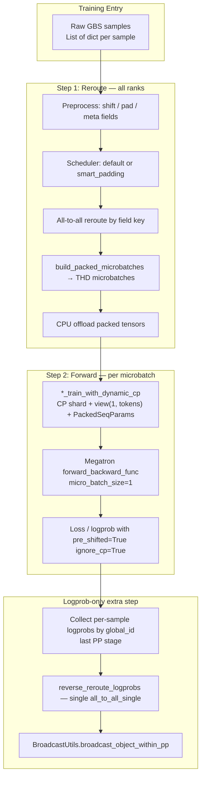

# Dynamic Context Parallel (Dynamic CP)

> **Audience:** human operators + AI agents implementing or extending Dynamic CP.
> **Abbreviation:** this doc uses **dyn_cp**. Elsewhere in the repo, **DCP** means PyTorch `torch.distributed.checkpoint`.

---

## TL;DR (for agents)

Dynamic CP replaces fixed Context Parallel with **per-sequence variable CP group sizes** inside a shared DP×CP resource pool. Samples are **scheduled → all-to-all rerouted → packed into THD microbatches** (`micro_batch_size=1`), then forwarded with Ring Attention + `PackedSeqParams`.

**To add a new training type**, implement in `extended_model/`:

1. `{task}_reroute_data_for_dynamic_cp(...)` — preprocess + schedule + pack (+ return `routing_info` if forward-only reverse is needed)
2. `{task}_train_with_dynamic_cp(...)` — CP shard one packed microbatch → `(batch_dict, fwd_kwargs)`

Then branch at the training entry (`mcore_engine` / `mixin`) on `dist_config.dynamic_context_parallel`.

**Critical invariants:**

- Pre-shift tokens in reroute (`input=tokens[:-1]`, `target=tokens[1:]`). Never `roll(-1)` on packed THD buffers.
- Split packed logprobs with **`cu_seqlens_padded` offsets**, truncate to **`cu_seqlens` original length** per sample.
- Packed microbatches live on **CPU** after reroute; H2D happens lazily in `*_train_with_dynamic_cp`.
- Loss uses `pre_shifted=True`, `ignore_cp=True` (CP comm handled in attention).
- Logprob reverse path: last PP stage only → `reverse_reroute_logprobs` → `BroadcastUtils.broadcast_object_within_pp`.

---

## 背景 / Background

在 RL / SFT 训练中，同一 batch 内序列长度差异很大。固定 CP 对所有序列使用相同切分粒度，短序列浪费算力、长序列分配不均。

**Dynamic CP** 按每条序列长度动态选择 CP 组大小：长序列分配更多 GPU 做 CP 切分，短序列用更少 GPU 或打包到同一 rank。在不改变总 GPU 数的前提下提高吞吐。

In RL/SFT training, sequence lengths within a batch vary drastically. Fixed CP wastes compute on short sequences. **Dynamic CP** assigns CP group size per sequence to improve GPU utilization without changing total GPU count.

---

## 架构总览 / Architecture Overview



### 并行维度交互 / Parallelism

| 维度 | 训练 | logprob (forward-only) |
|------|------|------------------------|
| **DP×CP** | reroute all-to-all; attention 内 Ring CP | 同上 + `reverse_reroute_logprobs` 还原 |
| **TP** | reroute 时 pad 对齐；forward 后 tokens 须 `% tp_size == 0` | 同训练 |
| **PP** | Megatron `forward_backward_func` 原生支持 | last stage 收集 logprob → reverse → **PP broadcast** |
| **VPP** | ❌ `virtual_pipeline_model_parallel_size > 1` | ❌ 同上 |

---

## 代码地图 / Code Map

| 文件 | 职责 |
|------|------|
| `gpatch_v4/configs/dist_config.py` | `DistConfig`：`dynamic_context_parallel`, `max_seqlen_per_dp_cp_rank`, `max_seqlen_per_dp_cp_rank_fwd_only`, `dynamic_cp_scheduler_type` |
| `gpatch_v4/configs/config.py` | 要求 `training.attention_backend='flash'` |
| `gpatch_v4/configs/policy_config.py` | 要求 `calculate_per_token_loss=True` |
| `gpatch_v4/core/parallel_state.py` | 初始化 Megatron dynamic CP parallel groups |
| `gpatch_v4/utils/dynamic_cp_utils.py` | 共享调度 / reroute / pack / **`reverse_reroute_logprobs`** |
| `gpatch_v4/extended_model/llm.py` | LLM 参考实现：`sft_*` / `grpo_*` reroute + train |
| `gpatch_v4/extended_model/qwen3_vl.py` | VLM 参考实现（含 vision 字段） |
| `gpatch_v4/extended_model/base.py` | `PrepareDataForward` 接口定义 |
| `gpatch_v4/training_backend/megatron_backend/mcore_engine.py` | `rl_train_actor` / `finetune_step` reroute 入口；**`compute_log_probs_dynamic_cp`** |
| `gpatch_v4/training_backend/megatron_backend/mixin.py` | `rl_forward_step`, `_finetune_func`, **`get_logprob_output_only_func_dynamic_cp`**, `compute_logprobs` |
| `gpatch_v4/actor/grpo_train_actor.py` | rollout 阶段选择 dynamic-CP logprob 路径 |

---

## 配置 / Configuration

```yaml
policy:
  dist_config:
    tensor_model_parallel_size: 2
    pipeline_model_parallel_size: 2
    context_parallel_size: 1              # 最大 CP 组大小 / max CP group size
    dynamic_context_parallel: True
    max_seqlen_per_dp_cp_rank: 4096       # 训练调度预算；开启 dyn_cp 时必填
    # max_seqlen_per_dp_cp_rank_fwd_only  # 可选；默认 = 4 × max_seqlen_per_dp_cp_rank
    min_dynamic_context_parallel_size: 1
    dynamic_cp_scheduler_type: default    # default | smart_padding

  override_transformer_config:
    calculate_per_token_loss: True        # dyn_cp 必填

training:
  attention_backend: flash                # dyn_cp 必填，否则 grad_norm NaN
```

### 参数说明 / Parameter Reference

| 参数 | 类型 | 默认 | 说明 |
|------|------|------|------|
| `dynamic_context_parallel` | bool | `False` | 开启 Dynamic CP |
| `max_seqlen_per_dp_cp_rank` | int | `None` | 每个 DP×CP rank 的最大 token 数（**训练** reroute 预算）。开启 dyn_cp 时必填 |
| `max_seqlen_per_dp_cp_rank_fwd_only` | int | `2 × max_seqlen` | **仅 forward** 路径（logprob / eval）的 reroute 预算。在 `DistConfig.__post_init__` 中自动填充 |
| `min_dynamic_context_parallel_size` | int | `1` | 最小 CP 组大小 |
| `context_parallel_size` | int | `1` | DP×CP 资源池上限；dyn_cp 在 `[min_cp, cp_size × dp_size]` 范围内选择 |
| `dynamic_cp_scheduler_type` | str | `"default"` | `"default"`: 全局排序 + all-to-all；`"smart_padding"`: 本地调度，无数据通信（需 smart padding 数据集） |

### 额外前置条件 / Additional Prerequisites

- Megatron-LM 含 Dynamic CP 支持（PR #2924, #3405, #2000）
- `context_parallel_size >= 2`
- 后端：`training_backend: mcore`
- 不支持 CUDA Graphs
- SFT 不能与 `training.use_dynamic_mbs` 同开
- SFT 不能与 `policy.smart_pad_train` 同开

---

## 已支持 / Supported Training Types

| 训练类型 | 状态 | reroute | train | logprob |
|----------|------|---------|-------|---------|
| GRPO / PPO (RL) | ✅ | `rl_reroute_data_for_dynamic_cp` | `grpo_train_with_dynamic_cp` | `compute_log_probs_dynamic_cp` |
| SFT | ✅ | `sft_reroute_data_for_dynamic_cp` | `sft_train_with_dynamic_cp` | 走标准 eval forward（无 reverse reroute） |
| On-Policy Distill | ✅ | `rl_reroute_data_for_dynamic_cp` | `opd_train_with_dynamic_cp` | — |
| DPO | 🔜 | 需新增 | 需新增 | — |
| Off-Policy Distill | 🔜 | 需新增 | 需新增 | — |

参考实现：`llm.py`（纯文本）、`qwen3_vl.py`（多模态）。

---

## 数据流详解 / Data Flow Details

### 1. Reroute（所有 rank 同步执行）

**入口：**

- GRPO 训练：`mcore_engine.rl_train_actor` → `rl_reroute_data_for_dynamic_cp`
- GRPO logprob：`mcore_engine.compute_log_probs_dynamic_cp`（reroute **一次**，ref/prev 共用 packed data）
- SFT：`mcore_engine.finetune_step` → `sft_reroute_data_for_dynamic_cp`

**每个 sample 预处理后应包含：**

| 字段 | 形状 | 说明 |
|------|------|------|
| `tokens`, `labels`, `loss_mask`, `position_ids` | `[padded_len]` | 已 pre-shift（RL 额外字段见下） |
| `original_seq_len` | scalar int32 | shift 后真实长度 |
| `padded_seq_len` | scalar int32 | pad 后长度 |
| RL: `advantages`, `prev_log_probs`, `ref_log_probs`, … | `[padded_len]` | 与 tokens 等长；放进 `packed_keys` 即可一起调度 |

**调度器：**

- **`default`** (`dyn_cp_schedule_default`): Megatron `DefaultDynamicCPScheduler` → 全局长度排序 → key-wise all-to-all → `build_packed_microbatches_by_keys`。返回 **`routing_info`**（GRPO logprob 反向通信用）。
- **`smart_padding`** (`dyn_cp_schedule_smart_padding`): 仅 SFT；本地选 cp_size，单次 scalar all-reduce(MAX)，**无样本 all-to-all**。要求 GBS 内 smart padding 后长度接近。

**Packed microbatch 输出字段（THD）：**

- `tokens`, `labels`, … — 1D concat，总长 = 本 rank 该 microbatch 所有子序列 token 之和
- `cu_seqlens`, `cu_seqlens_padded` — 子序列边界（**logprob split 必须用 padded 偏移**）
- `max_seqlen`, `local_cp_size` — 本 microbatch 的 CP 组大小
- `_dyn_cp_sample_ids` — 该 microbatch 内 global sample ID 列表（logprob 收集用）

**内存：** reroute 结束后 packed tensor **offload 到 CPU**；forward 时在 `*_train_with_dynamic_cp` 里 lazy `cuda(non_blocking=True)`。

### 2. Train forward（每个 microbatch）

`*_train_with_dynamic_cp(batches, seqlen, ...)` 约定 **`len(batches) == 1`**。

步骤：

1. H2D（若 tensor 在 CPU）
2. 若 `local_cp_size > 1`：按 `get_thd_partitioned_indices(cu_seqlens_padded, ...)` 对 token 维字段做 CP shard
3. `view(1, cp_tokens)` → BSH-like 输入
4. 构造 `PackedSeqParams(qkv_format="thd", local_cp_size=..., cp_group=...)`
5. `loss_mask` → `mask`，`labels` → `target`

Loss / logprob 计算开关：

```python
from_parallel_logits_to_logprobs(..., pre_shifted=True, ignore_cp=True)
# 或 logprobs_from_linear_ce(..., pre_shifted=True, ignore_cp=True)
```

指标 reduce：scalar 在 dynamic CP 组内 AVG；token 级 `[sum, count]` 在 DP+CP 组 all-reduce。

### 3. GRPO logprob 专用路径

与训练共用 reroute + `grpo_train_with_dynamic_cp`，但走 **forward-only** 分支：

```
grpo_train_actor.rollout
  └─ compute_log_probs_dynamic_cp          # mcore_engine.py
       ├─ rl_reroute_data_for_dynamic_cp(max_seqlen= max_seqlen_per_dp_cp_rank_fwd_only)
       ├─ _forward_packed_batches_unified  # Megatron forward_backward_func, micro_batch_size=1
       │    └─ get_logprob_output_only_func_dynamic_cp  # mixin.py
       └─ _reverse_and_collect            # per ref / prev
            ├─ [last PP only] reverse_reroute_logprobs  # single all_to_all_single
            └─ BroadcastUtils.broadcast_object_within_pp(result)
```

**`get_logprob_output_only_func_dynamic_cp` 内 per-sample split（易错点）：**

```python
# 偏移用 cu_seqlens_padded；长度用 cu_seqlens 原始长度
pad_start = cu_seqlens_padded[s_idx].item()
orig_len = cu_seqlens[s_idx + 1].item() - cu_seqlens[s_idx].item()
results.append(logprobs_flat[pad_start:pad_start + orig_len])
```

若 `local_cp_size > 1`，先在 CP 组内 scatter + all_reduce 重组完整 THD logprob，再 split。

**与非 dynamic-CP 对齐：** 非 dyn_cp topk 路径在 `mixin.compute_logprobs:1122` 做 `broadcast_object_within_pp`；dyn_cp 等价逻辑在 `_reverse_and_collect` 末尾（reverse reroute **之后**）。

### 4. `routing_info` 字段（GRPO logprob reverse 用）

由 `dyn_cp_schedule_default` 返回，经 `rl_reroute_data_for_dynamic_cp` 透传：

| key | 用途 |
|-----|------|
| `global_ids_this_rank` | 本 rank **reroute 前**拥有的 global sample ID |
| `global_id_logprob_lens` | `[(gid, logprob_len), ...]` 全局列表；len = `original_seq_len` |
| `gid_to_compute_rank` | 该 sample 在哪个 DCP rank 上算了 logprob |
| `gid_to_orig_dcp_rank` | 该 sample reroute 前属于哪些 DCP rank（该 DP index 下**所有** CP 兄弟 rank 的 list，而非单个 rank） |

`reverse_reroute_logprobs` 利用上述信息，**一次** `all_to_all_single` 把 logprob 发回原始 owner rank。

> **注意（2026.07 fix）**：rollout 数据在同一 DP index 的所有 CP 兄弟 rank 间是完全复制的
> （见 `is_mp_and_cp_head` + `broadcast_object_within_mp_and_cp`），所以每个 CP 兄弟 rank
> 都需要独立拿到一份 reverse 后的 logprob。`gid_to_orig_dcp_rank` 若只解析成单个
> rank（比如只用调用者自己 CP 切片内的 `dp_group` 反查），在 `cp_size>1` 时会因为
> 不同 CP 切片各自独立、自指地计算出**不同**的单一 owner，导致 `all_to_all_single`
> 的 send/recv split size 在跨 CP-parity 的方向上永远错配（一侧声明发 0，另一侧却
> 期望非 0），进而卡死。现已改为 `gid_to_orig_dcp_rank[gid]` 返回该 gid 所在 DP index
> 下的全部 CP 兄弟 rank，`reverse_reroute_logprobs` 对每个目标 rank 都重复发送一份。

---

## 接入新训练类型 / Adding a New Training Type

SFT / GRPO 遵循同一范式。按下列 checklist 实现（AI agent 可直接对照）。

### Step 0: 确认约束

- [ ] 不需要 VPP、MTP (deepseek_v3)、OPD、ppo_dump_metrics
- [ ] `attention_backend=flash`, `calculate_per_token_loss=True`
- [ ] 模型 extended class 继承 `PrepareDataForward`

### Step 1: `{task}_reroute_data_for_dynamic_cp`

**签名（GRPO 带 routing_info）：**

```python
def rl_reroute_data_for_dynamic_cp(
    self,
    gbs_batches: List[Dict[str, Any]],
    pad_token_id: int,
    pad_with_random_token: bool = False,
    **kwargs,  # vocab_size, max_seqlen_per_dp_cp_rank (override)
) -> Tuple[List[Dict], int, float, float, Dict[str, Any]]:
```

**SFT 无 routing_info：**

```python
) -> Tuple[List[Dict], int, float, float]:
```

**必须做：**

1. 计算 `pad_div = (2 * dp_cp_size) * tp_size`（smart_padding 见 `llm.py`）
2. 每条 sample：pre-shift、pad、写入 per-token 字段 + `original_seq_len` / `padded_seq_len`
3. 调用 `dyn_cp_schedule_default` 或 `dyn_cp_schedule_smart_padding`
4. 列出 `packed_keys`（所有需要一起 pack 的 per-token 字段）
5. GRPO：返回 `routing_info`；SFT smart_padding：不需要

**返回：**

- `packed_microbatches`: `List[Dict[str, Tensor]]`，CPU tensor
- `num_micro_batches`: forward 循环次数
- `seqlen_sum`, `seqlen_sq_sum`: 监控指标
- `routing_info`（可选）：logprob reverse 用

### Step 2: `{task}_train_with_dynamic_cp`

**签名：**

```python
def xxx_train_with_dynamic_cp(
    self,
    batches: List[Dict[str, Any]],  # len == 1
    seqlen: int,
    pad_token_id: int,
    ...
) -> Tuple[Dict[str, Tensor], Dict[str, Tensor]]:
    # returns (batch_dict_for_loss, fwd_kwargs_for_model)
```

**必须做：**

1. Lazy H2D
2. CP shard（`get_thd_partitioned_indices` + `get_dynamic_data_context_parallel_groups(group_size=local_cp_size)`）
3. TP 对齐 assert
4. `PackedSeqParams` + `view(1, tokens)`
5. 字段 rename：`loss_mask→mask`, `labels→target`

### Step 3: 训练入口分流

| 场景 | 文件 | 分支位置 |
|------|------|----------|
| RL 训练 reroute | `mcore_engine.rl_train_actor` | `dynamic_context_parallel` → `rl_reroute_data_for_dynamic_cp` |
| RL forward step | `mixin.rl_forward_step` | → `grpo_train_with_dynamic_cp` |
| RL logprob | `grpo_train_actor` + `mcore_engine.compute_log_probs_dynamic_cp` | 独立路径 |
| SFT reroute | `mcore_engine.finetune_step` | → `sft_reroute_data_for_dynamic_cp` |
| SFT forward | `mixin._finetune_func` | → `sft_train_with_dynamic_cp` |

### Step 4（可选）: Forward-only / logprob

若新任务需要在 dyn_cp 下算 per-token 输出并还原到原始 sample 布局：

1. reroute 必须走 `dyn_cp_schedule_default` 并保存 `routing_info`
2. 实现或复用 `get_logprob_output_only_func_dynamic_cp` 模式的 forward step
3. last PP stage 按 `_dyn_cp_sample_ids` 收集 `Dict[gid, Tensor]`
4. 调用 `reverse_reroute_logprobs` + `broadcast_object_within_pp`
5. logprob reroute 预算用 `max_seqlen_per_dp_cp_rank_fwd_only`

### Step 5: 注册接口

在 `extended_model/base.py` 添加/更新抽象方法；在具体模型类 `@override`。

---

## 已知限制 / Known Limitations

| 不兼容项 | 行为 |
|----------|------|
| `virtual_pipeline_model_parallel_size > 1` | `DistConfig.__post_init__` assert |
| `model_arch == deepseek_v3` (MTP) | `_update_policy` assert |
| `ppo_dump_metrics_interval > 0` | `_update_policy` assert |
| `OffPolicyDistillConfig` | 未实现 |
| `training.use_dynamic_mbs` + dyn_cp SFT | `finetune_step` assert |
| `policy.smart_pad_train` + dyn_cp SFT | `_finetune_step` assert |
| GRPO + `smart_padding` scheduler | 未实现（GRPO 固定 `default`） |
| CUDA Graphs | 不支持 |

**已支持（以前文档未更新）：**

- **PP > 1** 训练与 logprob（logprob 在 `_reverse_and_collect` 末尾 PP broadcast）
- **`max_seqlen_per_dp_cp_rank_fwd_only`** 独立 logprob 调度预算

---

## 调参建议 / Tuning Tips

1. **`max_seqlen_per_dp_cp_rank`** — 最关键。太小 → microbatch 过多；太大 → OOM。建议从单卡最大 seq len 的 ~80% 起试。
2. **`max_seqlen_per_dp_cp_rank_fwd_only`** — logprob 无 backward，默认 2× 训练预算；OOM 时可单独调小。
3. **`min_dynamic_context_parallel_size`** — SFT 通常保持 `1`。
4. 观察 `[TRAIN-DYN-CP]` / `[SFT-DYN-CP]` 日志，`scheduled num_micro_batches` 越少通常越好。
5. 监控 `policy/dyn_cp_num_micro_batches`、`finetune/dyn_cp_num_micro_batches`。

---

## 示例 / Examples

```bash
# GRPO（默认开启 dyn_cp）
bash tasks/math_rl_v4/scripts/grpo.sh

# SFT dyn_cp
bash tasks/math_rl_v4/scripts/sft_dyn_cp.sh
```

关闭：`dynamic_context_parallel: False` → 回退固定 CP / BSH 路径。

---

## 正确性对齐实验 / Correctness Benchmarks

### math (qwen2)

| 模式 | 脚本 | acc | fmt |
|------|------|-----|-----|
| 原版 | `tasks/math_rl_v4/scripts/sft.sh` | 0.575 | 0.695 |
| dynamic-cp | `tasks/math_rl_v4/scripts/sft_dyn_cp.sh` | 0.578 | 0.697 |

WandB: [原版](http://wandb.testsite.woa.com:8080/plt2/dynamic_cp_riona/runs/0byzv68x) / [dyn_cp](http://wandb.testsite.woa.com:8080/plt2/dynamic_cp_riona/runs/s8qmm7rk)

### qwen3vl

| 模式 | 脚本 | acc |
|------|------|-----|
| 原版 | `tasks/multimodal_v4/finetune/scripts/finetune_qwen3vl_pmc_vqa.sh` | 0.65 |
| dynamic-cp | `tasks/multimodal_v4/finetune/scripts/finetune_qwen3vl_dyn_cp.sh` | 0.65 |

WandB: [原版](http://wandb.testsite.woa.com:8080/plt2/qwen3_vl_v4/runs/ptn8fb2m) / [dyn_cp](http://wandb.testsite.woa.com:8080/plt2/qwen3_vl_v4/runs/i9kml6ew)

---

## 调试清单 / Debug Checklist

logprob 数值异常（`ppo_ratio` / `k3_kl` 爆炸）时按序检查：

1. packed logprob split 是否用 **`cu_seqlens_padded`** 偏移 + **`cu_seqlens`** 原始长度
2. reroute 是否 pre-shift（禁止 post-pack `roll(-1)`）
3. ref/prev 是否共用**同一次** reroute 的 packed data
4. `reverse_reroute_logprobs` 的 `gid_to_*` 映射是否与调度一致
5. PP > 1 时是否在 reverse 之后做了 **`broadcast_object_within_pp`**
6. 训练 vs logprob 的 `max_seqlen_per_dp_cp_rank` 预算是否混用

可选工具：`debug.compare_logprob_paths=True`（BSH vs dyn_cp 数值对比，见 `gpatch_v4/utils/logprob_compare_utils.py`）。
### 注意事项 / Notes

- packed 后每个 microbatch 在 token 维度上是 **THD 格式**（所有 sample 拼接成一条），所以 `micro_batch_size=1`。
- Loss 内不做 static CP all-reduce（CP 通信由 attention 层处理）；scalar 报告指标在动态 CP 组内 AVG，token 级 `[sum, count]` 在 DP+CP 组内 all-reduce。
- THD pack 后不能整体 `roll(-1)`（会污染子序列边界），所以在 reroute 里**预先 shift**（input = `tokens[:-1]`、target = `tokens[1:]`），loss 用 `from_parallel_logits_to_logprobs(..., pre_shifted=True)`。
